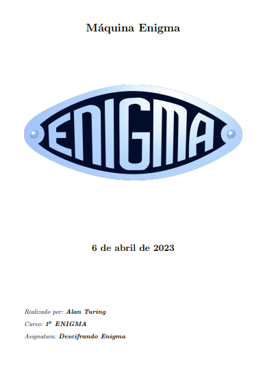
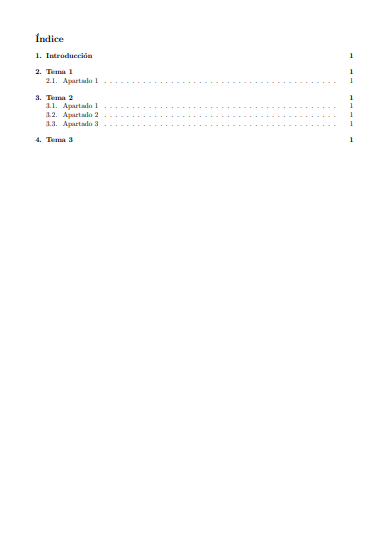
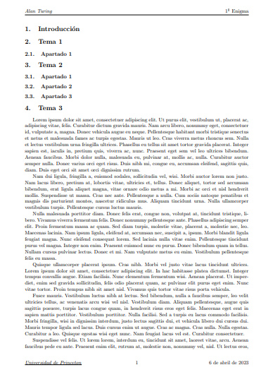

# latex-school-template
Plantilla de LaTeX para tus trabajos de la escuela.
Esta plantilla sirve para hacer documentos formales para tus trabajos de escuela, instituto, universidad, etc.
# Imágenes
Aquí tienes unas imágenes de ejemplo para que veas el resultado de cada parte de la plantilla:
### Portada

### Página de índice

### Página de contenido

# Requisitos
* Saber LaTeX a un nivel medio
* Requerir de un compilador de LaTeX
    * [Overleaf](https://overleaf.com) (compilador, guardado de PDFs salientes y en Internet)
    * [Miktex](https://miktex.org/download) (compilador offline, se necesita tener instalado [perl](https://www.perl.org/get.html))
    * etc.
# Explicación
La plantilla está en la carpeta [template](template) que cuelga de [main](https://github.com/elalecras/latex-school-template) y se llama [school-document-template.tex](template/school-document-template.tex)
Ruta completa: [template/school-document-template.tex](template/school-document-template.tex)
## Estructura de la plantilla
La plantilla se estructura de la siguiente manera:
- **Tipo de documento**: Clase de documento LaTeX que se va a usar.
- **Paquetes**: Paquetes necesarios para construir tu documento.
- **Comandos personalizados**: Comandos personalizados para poder manipular de manera sencilla ciertos nombres especiales en el documento (como autor, fecha, título, etc.).
- **Comandos renovados/modificados**: Apartado de comandos remodificados a tu gusto.
- **Encabezados y pies de página**: Modifica los encabezados y pies de página para tu documento (*sólo para la sección de documento*).
- **Documento**: Es donde está el contenido del documento. A su vez, tiene secciones:
    - **Portada**: Seccion que contiene la portada del documento.
    - **Página de índice**: Sección que contiene la página con la tabla de contenidos de las secciones que crees.
    - **Páginas de contenido**: Sección que contiene el contenido real del documento: secciones, explicaciones, temas, bibliografía, etc.
## Avisos y recordatorios
Recuerde que es importante mantener en todo momento la estructura que se indicó arriba, sobre todo para no perderse en el archivo y mantener el orden, claridad y legibilidad del mismo.

ESTE SOFTWARE ES DISTRIBUIDO BAJO LA LICENCIA [GPLv3](https://www.gnu.org/licenses/gpl-3.0.html).
## Ayuda y contacto
Puedes preguntarme por cualquier cosa acerca del proyecto mediante mis redes sociales:

* [Twitter](https://twitter.com/alecraoficial)
* [Instagram](https://instagram.com/alecraaaa)